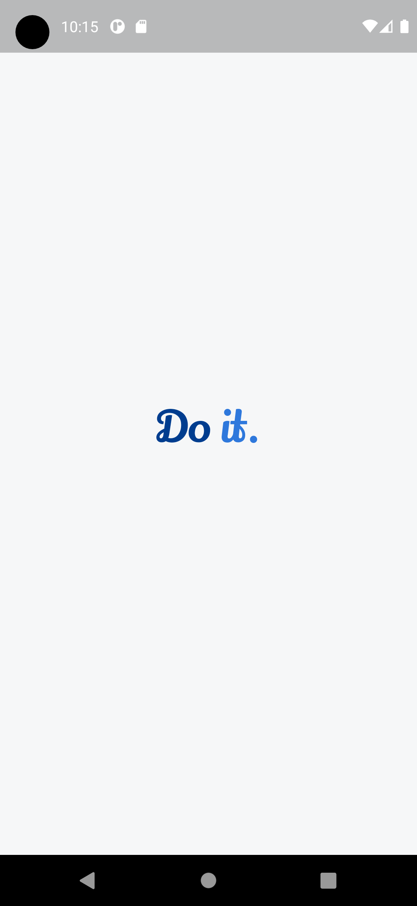
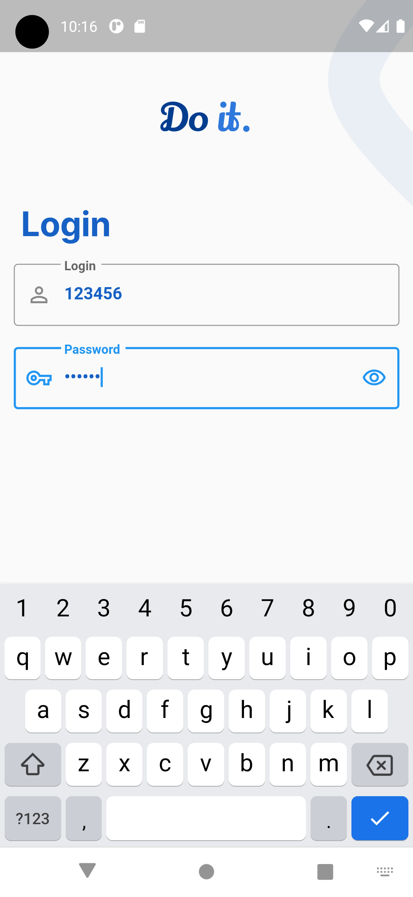
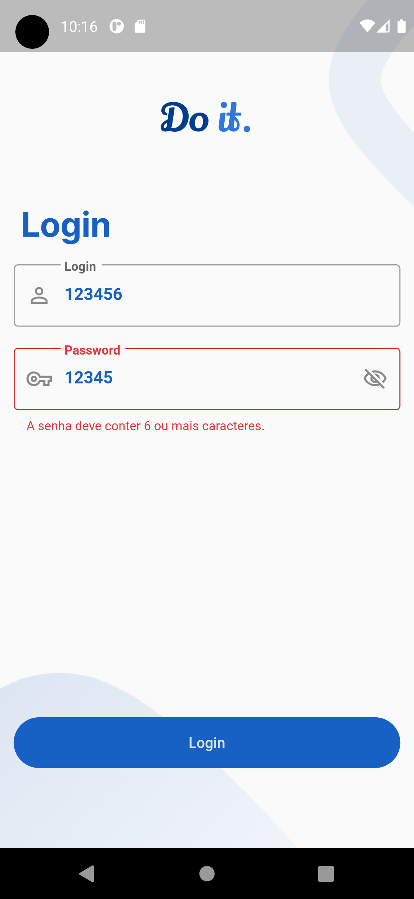
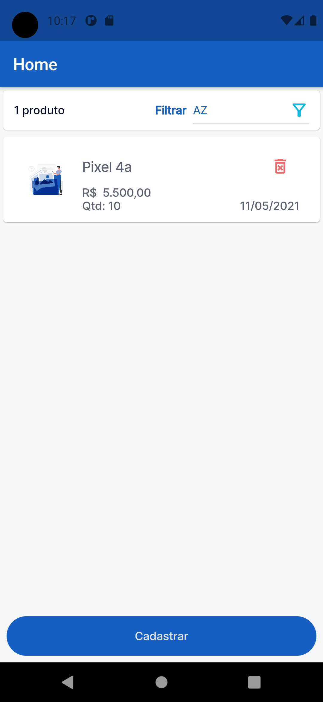
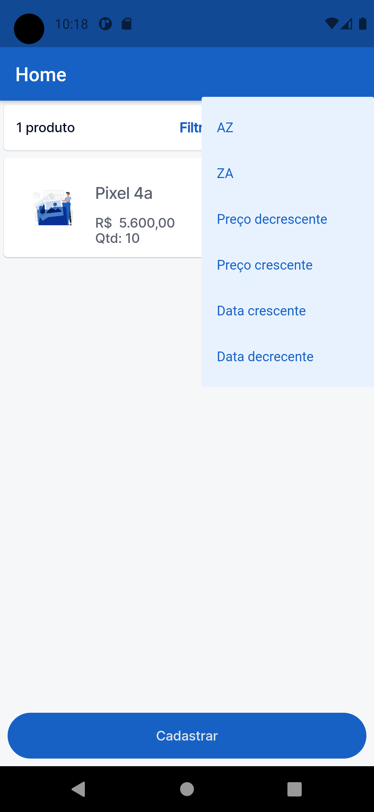
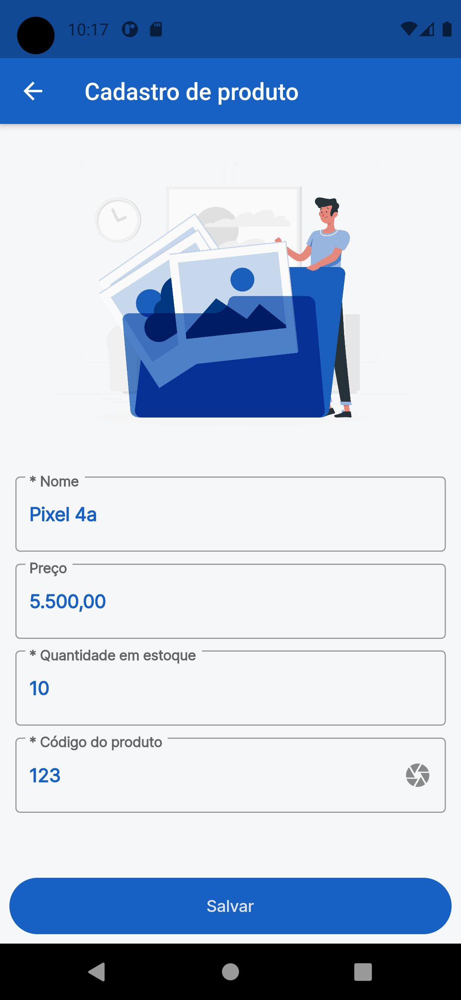
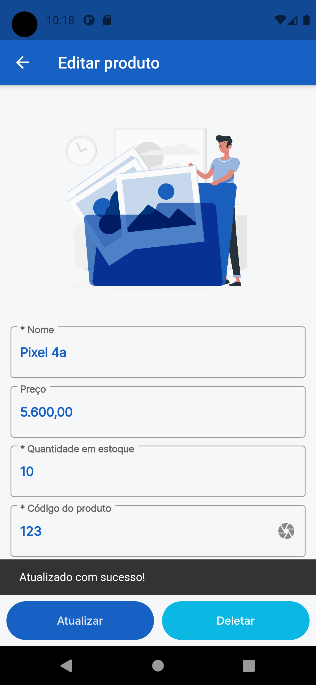
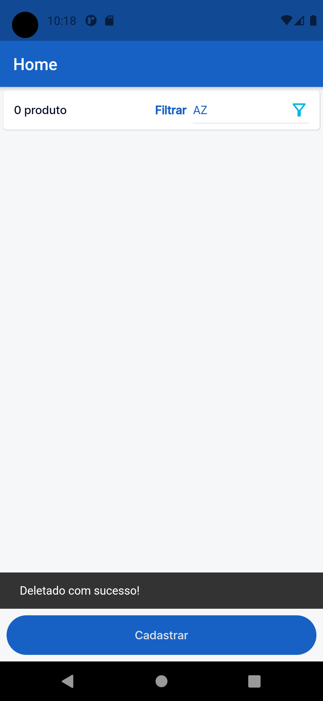

<h1 align="center">
   Challenge Registration
</h1>

<h2>
Aplicativo com representação de cadastro de produtos. 
</h2>
<br/>

# Indice

- [Sobre](#-sobre)
- [Tecnologias Utilizadas](#-tecnologias-utilizadas)
- [Como baixar o projeto](#-como-baixar-o-projeto)

## 🔖&nbsp; Sobre

> Desafio de um aplicativo de cadastro de produtos.

- Deve ser possível que se adicione, edite e remova itens da lista de produtos.
- Todos os dados devem ser salvos localmente.
- Login deve ser persistido, na segunda execução acessar a tela
  principal.

---

## 🚀 Tecnologias utilizadas

O projeto foi desenvolvido utilizando as seguintes tecnologias

- [Dart 2.12.3](https://dart.dev/)
- [Flutter 2.0.6 Null safety](https://flutter.dev/)

  **dependencies:**

- [google_fonts: ^2.0.0](https://pub.dev/packages/google_fonts)
- [flutter_modular: ^3.2.0](https://pub.dev/packages/flutter_modular)
- [shared_preferences: ^2.0.5](https://pub.dev/packages/shared_preferences)
- [brasil_fields: ^1.1.2](https://pub.dev/packages/brasil_fields)
- [intl: ^0.17.0](https://pub.dev/packages/intl)

  **dev_dependencies:**

- [pedantic: ^1.11.0 Lints](https://pub.dev/packages/pedantic)

---

## Como baixar o projeto

```bash

    # Clonar o repositório
    $ git clone https://github.com/edilson-rodrigues/challenge_registration.git

    # Entrar no diretório
    $ cd challenge_registration

    # Instalar as dependências
    $ flutter pub get

    # Iniciar o projeto
    $ flutter run

```

### login e senha 123456

---

## Screens










---

<a>Desenvolvido por Edilson Rodrigues</a>
